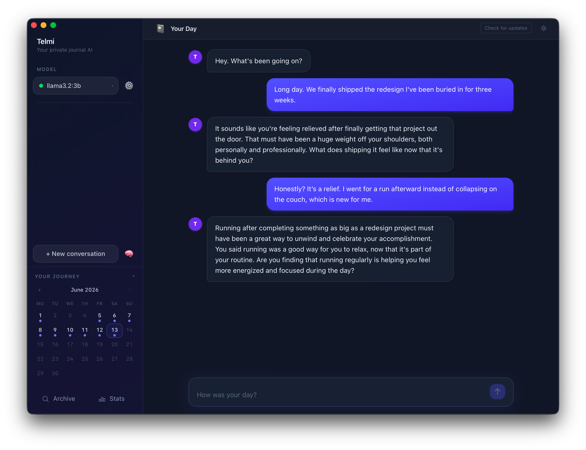
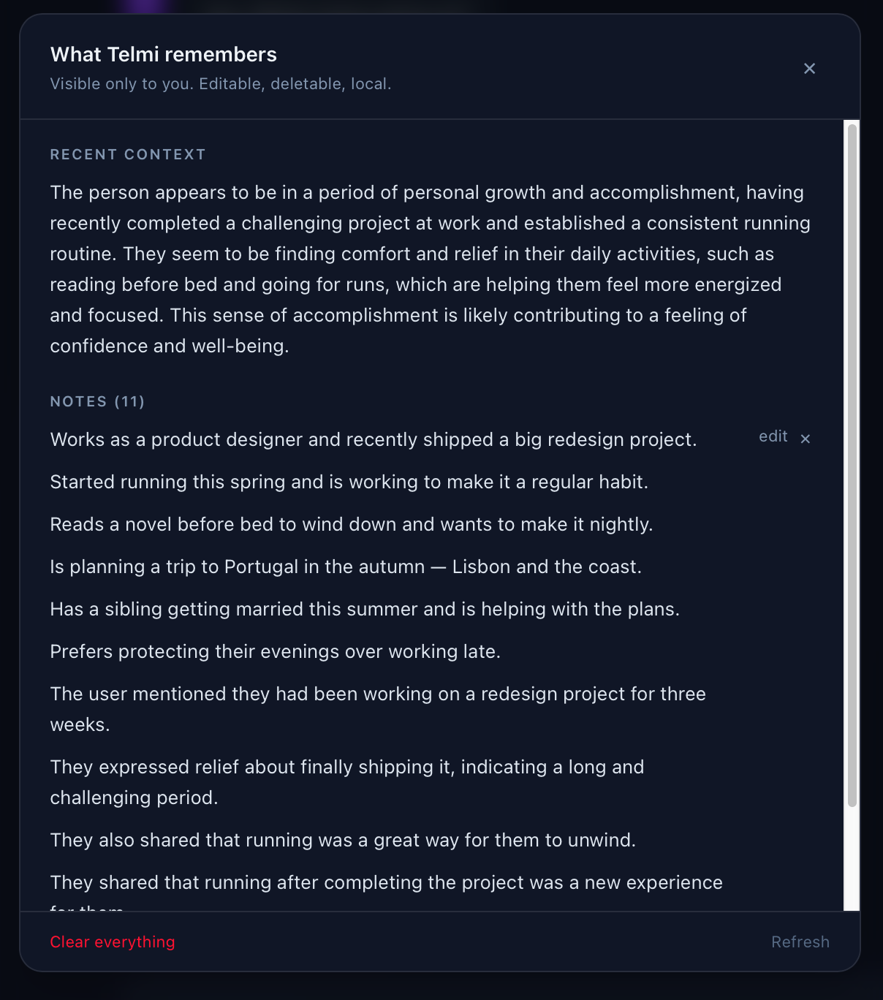
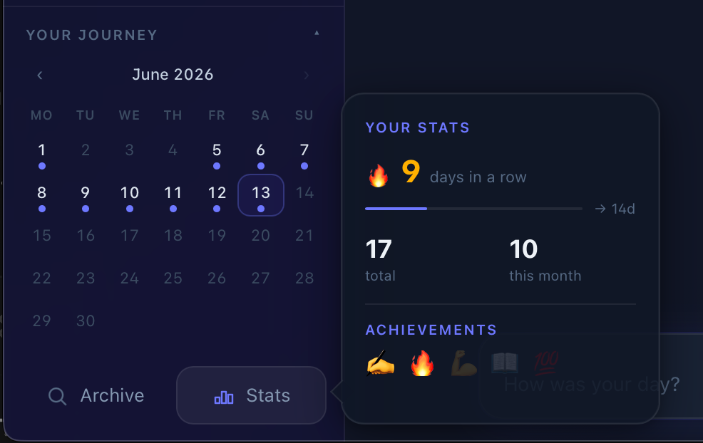
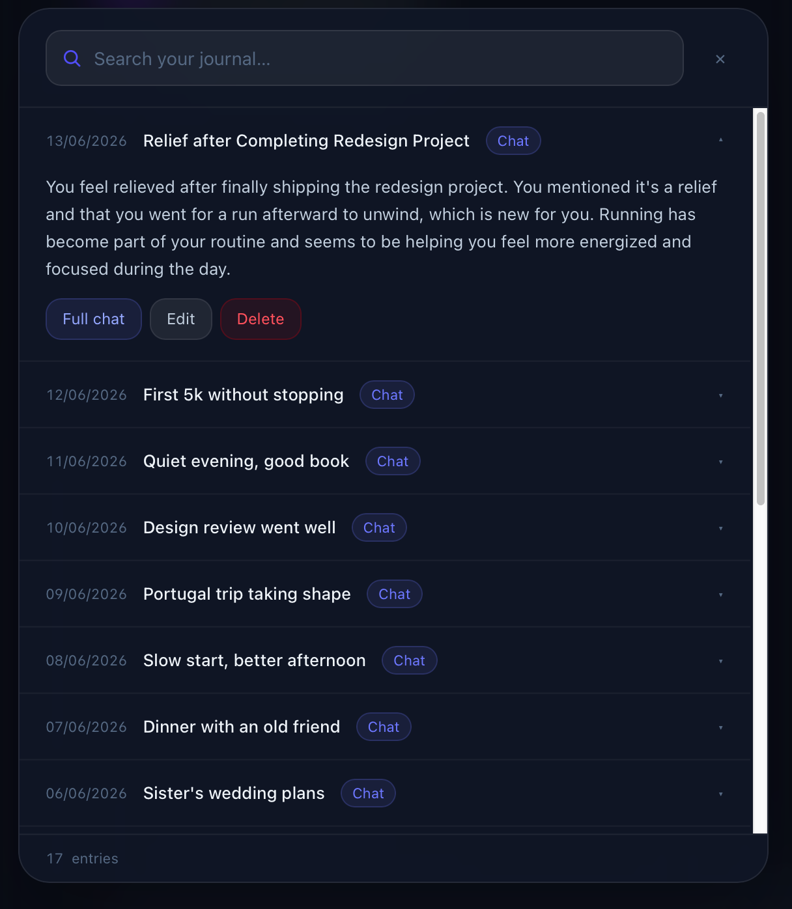

# Telmi — Your Private AI Companion

*Tell your day. Telmi listens, and remembers.*

| Your Day | What Telmi remembers | Life Dashboard | Archive & search |
| :---: | :---: | :---: | :---: |
| <a href="./screenshots/yourday_chat.png"></a> | <a href="./screenshots/memory_panel.png"></a> | <a href="./screenshots/dashboard.png"></a> | <a href="./screenshots/archive_search.png"></a> |

Your thoughts stay on your machine. No cloud. No subscription. No one reading your diary.

Telmi is a native macOS companion powered by local AI. Tell it about your day, talk through whatever's on your mind, share your secrets. Telmi listens, remembers what matters, and gets better at knowing you over time — without sending a single word to a server.

---

## How it works

Open Telmi and start talking. One calm, focused conversation — no modes to pick, no setup ritual. Tell it how your day went, what's weighing on you, what you're excited about. Telmi replies briefly and naturally, then quietly keeps notes on the things worth remembering.

Next time you open it, it already knows you.

---

## What makes it different

- **Fully local.** Everything runs on your Mac. Nothing is ever sent to a server.
- **No subscription.** No API key. No usage limits. You own the models, you own the data.
- **Runs on 8 GB RAM.** No GPU required. Works on everyday hardware.
- **Remembers you.** Telmi keeps short notes about you and a rolling summary of recent sessions, so it never starts from scratch.
- **You control the memory.** A built-in **"What Telmi remembers"** panel lets you read, edit, or delete every note Telmi keeps — nothing is hidden.
- **Shape its personality.** Edit Telmi's character prompt in [Settings](./screenshots/settings_character.png) to change its tone and style, or reset to the default anytime.
- **Auto-saves.** No save button. Start a new conversation or close the app — Telmi remembers automatically.
- **Life Dashboard.** A calendar showing every day you've talked, streaks, and monthly stats — built into the sidebar.
- **Searchable archive.** Browse and full-text/semantic-search every past conversation.
- **Open models.** Switch between any model you have installed in Ollama. Upgrade when you want.

---

## Download

**→ [Latest release](../../releases/latest)** — download the `.dmg`, open it, drag Telmi to Applications.

> macOS only. Apple Silicon (M1 and later).

> **"Telmi is damaged and can't be opened"** — this is a Gatekeeper warning because the app isn't signed with an Apple certificate. Run this once in Terminal, then open normally:
> ```bash
> xattr -cr /Applications/Telmi.app
> ```

---

## Setup

Telmi guides you through setup on first launch. The only prerequisite is Ollama.

**1. Install [Ollama](https://ollama.com)**

Download the Ollama desktop app — it starts automatically in the background.

**2. Open Telmi**

The app detects whether Ollama is running and whether any models are installed. If something is missing, it tells you exactly what to do.

| Install Ollama | Pick a model |
| :---: | :---: |
| <a href="./screenshots/ollama_onboarding.png"></a> | <a href="./screenshots/model_onboarding.png"></a> |

**Recommended models by RAM:**

| RAM    | Model            | Size   | Notes |
|--------|------------------|--------|-------|
| 8 GB   | `llama3.2:3b`    | 2.0 GB | Good starting point |
| 16 GB  | `llama3.1:8b`    | 4.7 GB | Noticeably better responses |
| 32 GB+ | `qwen2.5:32b`    | 20 GB  | Best experience |

**Optional — semantic search** (activates automatically once you have 15+ entries):
```bash
ollama pull nomic-embed-text
```

---

## Build from source

Requirements: [Node.js](https://nodejs.org), [Rust](https://rustup.rs), [Python 3.11+](https://python.org), [Ollama](https://ollama.com)

```bash
# 1. Clone
git clone https://github.com/vlad-codes/telmi-journal.git
cd telmi-journal

# 2. Python dependencies
pip3 install -r requirements.txt

# 3. Build the backend binary
pyinstaller telmi-backend.spec --distpath frontend/src-tauri/binaries --noconfirm
# Tauri expects the sidecar with a target-triple suffix:
mv frontend/src-tauri/binaries/telmi-backend \
   frontend/src-tauri/binaries/telmi-backend-aarch64-apple-darwin

# 4. Dev mode (two terminals)
uvicorn api:app --reload          # terminal 1 — backend
cd frontend && npm run tauri dev  # terminal 2 — app

# 5. Release build
cd frontend && npm run tauri build
# DMG output: frontend/src-tauri/target/release/bundle/dmg/
```

---

## Privacy

All data lives exclusively on your machine:

| File | Contents |
|------|----------|
| `memory.json` | Conversations + chat history |
| `notes.json` | Short notes Telmi keeps about you |
| `recent_brief.txt` | Rolling summary of your recent sessions |
| `character_prompt.txt` | Your custom personality for Telmi (only if you edit it) |
| `chroma_db/` | Vector embeddings for semantic search |

None of these are included in this repository. Telmi never phones home.

---

## License

MIT — see [LICENSE](LICENSE).
